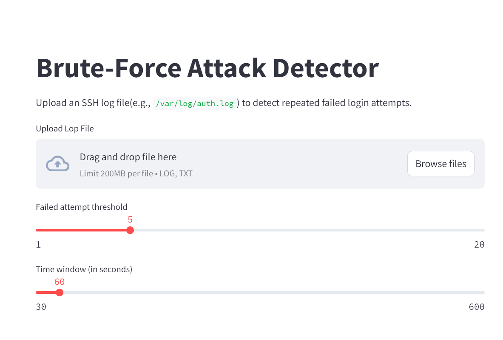
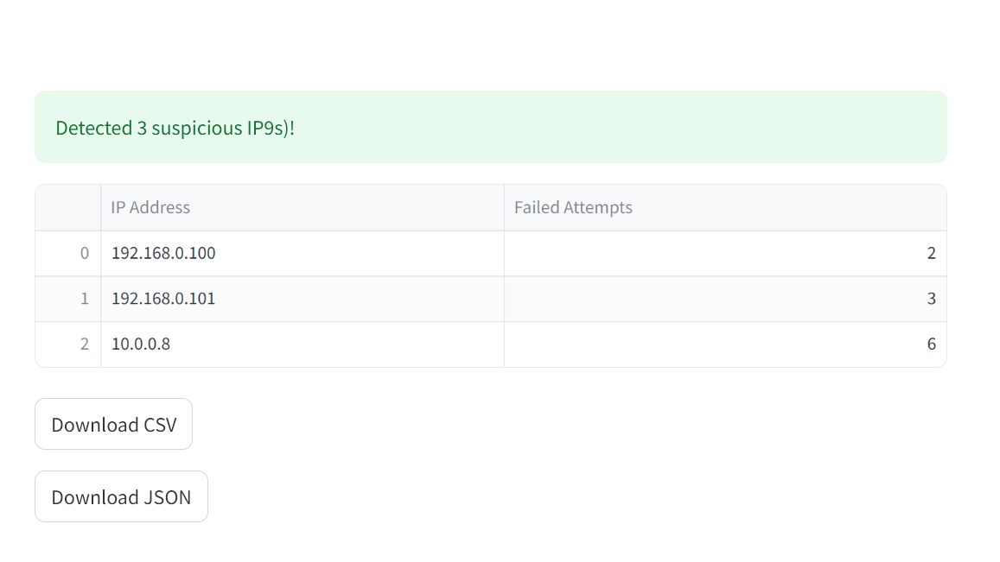

# 🛡️ Brute-Force Attack Detector

A Python-based tool with **Streamlit GUI** and **command-line interface (CLI)** to detect brute-force SSH login attempts from system log files (e.g., `/var/log/auth.log`).

---

## 🔍 Features

- ✅ Detect repeated failed login attempts from IPs
- ✅ Adjustable detection threshold and time window
- ✅ GUI mode with interactive filters and export options
- ✅ CLI mode for automation and headless servers
- ✅ Output results in CSV and JSON formats
- ✅ Highlight suspected attackers by IP and username

---

## 🚀 Getting Started

### 🔧 Installation

```bash
git clone https://github.com/raza360ahmed/Brute-Force-Attack-Detector.git
cd Brute-Force-Attack-Detector
pip install -r requirements.txt

🖥️ Usage
✅ GUI Mode (Streamlit)
Launch the app:
streamlit run detector.py
Upload a .log file, adjust the threshold and time window, then view and download results.

🧪 CLI Mode (Terminal)
python detector.py --file auth.log --threshold 5 --window 60
This prints suspicious IPs with failed login attempts within the defined time window.

📁 Project Structure
Brute-Force-Attack-Detector/
├── detector.py
├── auth.log              # Sample log for testing
├── README.md
├── .gitignore
├── requirements.txt

🧾 Sample Output
[!] Suspicious IP: 192.168.0.101 | Failed Attempts: 6 | Last Attempt: 2025-06-02 06:23:37 | User: root

🖼️ Screenshot




📦 Dependencies
streamlit
pandas
colorama

Install with:
pip install -r requirements.txt
